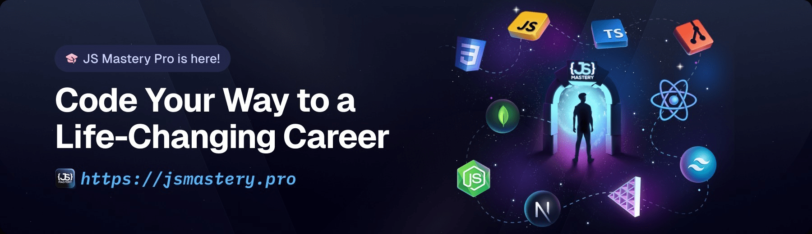

<h1>
  
  Velvet Pour
</h1>

Velvet Pour is a modern React-based imaginary cocktail bar website—designed to catch the eye and engage visitors with striking animations, smooth interactivity, and responsive design. Built with Vite, TailwindCSS, GSAP, and React.

<p align='center'>
  <a href="https://vitejs.dev/">
    
  </a>
  <a href="https://tailwindcss.com/">
    
  </a>
  <a href="https://greensock.com/gsap/">
    
  </a>
  <a href="https://react.dev/">
    
  </a>
</p>

<p align="center">
  <a href="https://velvet-pour-sepia.vercel.app/" target="_blank">
    
  </a>
</p>

[🌐 Live Demo](https://velvet-pour-sepia.vercel.app/)

---

## 🌟 Features & Highlights

- ✨ Immersive Animations – Eye-catching hero section and smooth page transitions powered by GSAP
- 📱 Fully Responsive – Adaptive navigation and layouts that look great on any device
- 🍹 Interactive Menu – Browse cocktails and mocktails through a sleek, animated slider
- 🎨 Branded Experience – Dedicated About, Art, and Contact sections for a complete storytelling flow
- 🔤 Custom Design Touches – Unique fonts and icons that reinforce the brand’s personality

---

## ⚙️ Tech Stack

- ⚡ React + Vite – Fast, modern foundation for building interactive UIs
- 🎨 TailwindCSS – Utility-first styling for clean, responsive layouts
- 🌀 GSAP – Advanced animations and scroll effects that bring the page to life
- 🔎 React Icons – Lightweight, scalable icons for visual consistency
- 📏 React Responsive – Media query hooks for seamless device adaptability

---

## 🚀 Getting Started

To run or develop locally:

```bash
git clone https://github.com/NayeraGad/velvet-pour.git
cd velvet-pour
npm install
npm run dev
```

After installation, open http://localhost:3000 (or the indicated port) to preview your animated landing page.

To build for production:

```bash
npm run build
```

## 📁 Project Structure

📦 velvet-pour

├── 📂 public

│ ├── 📂 images # Static images

│ ├── 📂 fonts # Custom fonts

│ ├── 📂 videos # Video assets

├── 📂 src

│ ├── 📂 components # React components

│ ├── 📂 constants # Data and lists

│ ├── 📜[App.jsx](http://_vscodecontentref_/0) # Main app

│ ├── 📜[index.css](http://_vscodecontentref_/1) # Styles

│ ├── 📜[main.jsx](http://_vscodecontentref_/2) # Entry point

## 🙌 Credits & Inspiration

This project was inspired by a YouTube tutorial from JavaScript Mastery.

<a href="https://jsmastery.com/" target="_blank"></a>
